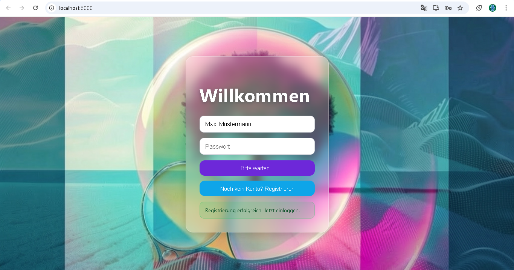
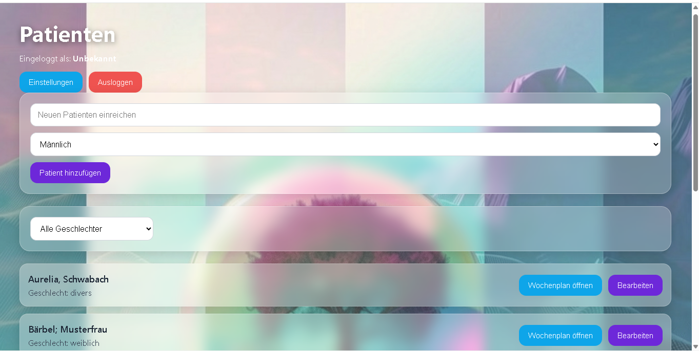
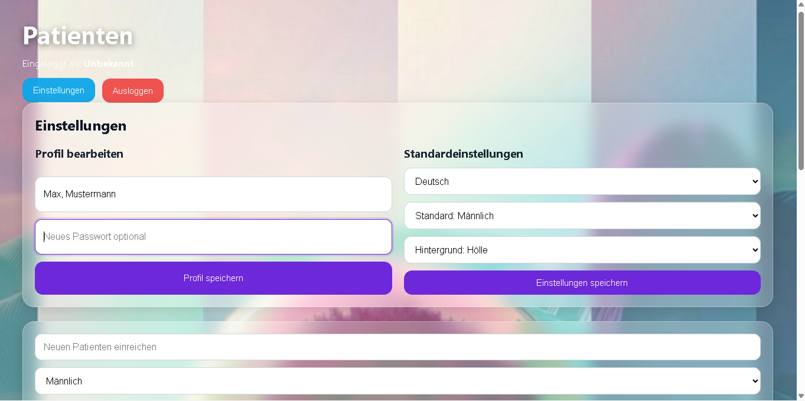
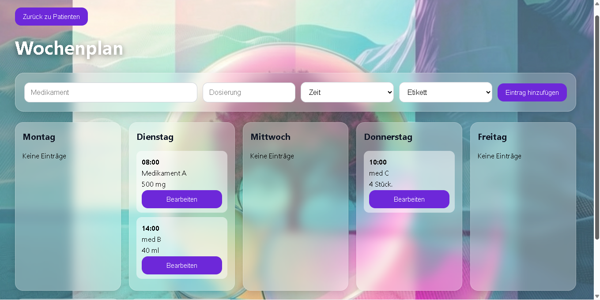

# MedPlaner – Patient & Medication Management App

Fullstack web application for managing patients and weekly medication schedules. Built with React, Node.js and Express, featuring JWT authentication, protected API routes and CRUD functionality.

## Overview

MedPlaner is a fullstack web application that allows users to create and manage patients as well as medication schedules in a structured weekly view.

The project focuses on user authentication, protected data access, frontend-backend communication and clean CRUD workflows.

## Key Features

- User registration and login
- JWT-based authentication
- Protected API routes
- Patient management (create, edit, delete)
- Weekly medication schedule management
- Create, update and delete medication entries
- Filter and sorting functionality
- User-specific data access
- Error and success feedback in the UI

## Tech Stack

### Frontend
- React
- React Router
- JavaScript
- CSS

### Backend
- Node.js
- Express
- JWT
- bcrypt

### Data Storage
- JSON files for demo purposes

## Security

- Password hashing with bcrypt
- JWT authentication
- Protected routes
- User-based access control

## Project Goal

This project was built to demonstrate practical fullstack development skills, including authentication, API integration, route protection, state handling and structured UI development.

## Future Improvements

- Replace JSON storage with a real database such as PostgreSQL or MongoDB
- Deploy frontend and backend
- Add form validation improvements
- Add tests
- Improve responsive design

## Screenshots

### Login

Users can log in to access the protected patient management area.

---

### Registration Feedback

After a successful registration, the app gives direct feedback to the user.

---

### Patient Management

Users can create patients, filter the list and open individual weekly medication plans.

---

### User Settings

The settings area allows users to update profile information and default preferences.

---

### Weekly Medication Plan

Each patient has an individual weekly medication schedule with medication name, dosage and time.

## Author

Created by Kay Liehr
