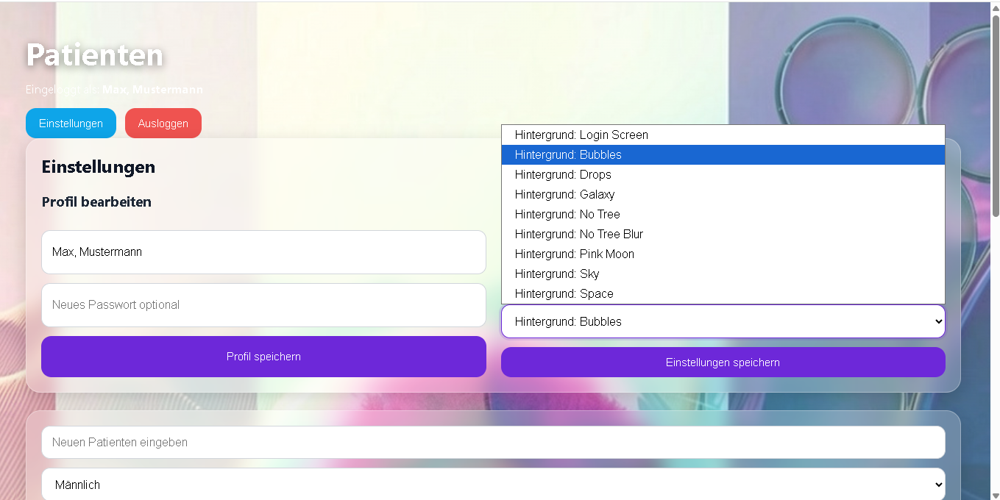
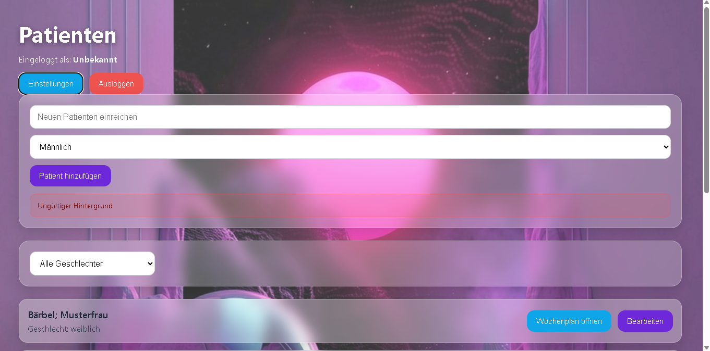

# MedPlaner – Patient & Medication Management App

Fullstack web application for managing patients and weekly medication schedules. Built with React, Node.js and Express, featuring JWT authentication, protected API routes, CRUD functionality and customizable user preferences.

## Overview

MedPlaner is a fullstack web application that allows users to create and manage patients as well as medication schedules in a structured weekly view.

The project focuses on user authentication, protected data access, frontend-backend communication, clean CRUD workflows and user-specific settings.

Users can manage their patient records, open individual weekly medication plans and customize parts of the user interface, including selectable background designs for the patient and calendar pages.

## Key Features

- User registration and login
- JWT-based authentication
- Protected API routes
- Patient management (create, edit, delete)
- Weekly medication schedule management
- Create, update and delete medication entries
- Filter and sorting functionality
- User-specific data access
- User settings for profile and preference management
- Custom background selection from predefined visual themes
- Persistent background preferences through the backend
- Background selection applied to the patient overview and weekly calendar pages
- Error and success feedback in the UI

## Tech Stack

### Frontend
- React
- React Router
- JavaScript
- CSS

### Backend
- Node.js
- Express
- JWT
- bcrypt

### Data Storage
- JSON files for demo purposes

## Security

- Password hashing with bcrypt
- JWT authentication
- Protected routes
- User-based access control

## Project Goal

This project was built to demonstrate practical fullstack development skills, including authentication, API integration, route protection, state handling, user-specific data handling, persistent preferences and structured UI development.

## Future Improvements

- Replace JSON storage with a real database such as PostgreSQL or MongoDB
- Deploy frontend and backend
- Add form validation improvements
- Add tests
- Improve responsive design
- Add medication reminder functionality
- Add more advanced search and filtering options
- Add more customization options for user preferences

## Screenshots

### Login

Users can log in to access the protected patient management area.

---

### Registration Feedback

After a successful registration, the app gives direct feedback to the user.

---

### Patient Management

Users can create patients, filter the list and open individual weekly medication plans.

---

### User Settings

The settings area allows users to update profile information and default preferences.

---

### Background Selection

Users can choose from multiple predefined background designs inside the settings area.  
The selected background is saved as a user preference and applied across the patient and calendar pages.

---

### Background Preview

The patient overview updates visually based on the selected background theme.

---

### Weekly Medication Plan

Each patient has an individual weekly medication schedule with medication name, dosage and time.

## Author

Created by Kay Liehr